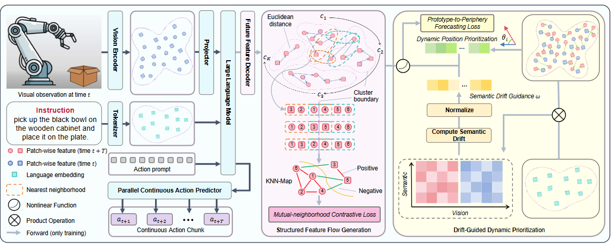

# LEEVLA
Authors: Qi Lyu, Baichen Liu, Xudong Wang, Jiahua Dong, Lianqing Liu, Zhi Han
## 📌 Abstract
Large Vision-Language Models (LVLMs) have achieved remarkable progress in multimodal understanding, yet their enormous parameter scale and cross-modal computation incur substantial memory and latency overhead, severely limiting real-world deployment on resource-constrained devices. Binarization offers an attractive solution by drastically reducing storage and computational costs. However, existing binarization methods neglect the varying importance of weights across different layers and modalities. This causes parameters irrelevant to downstream tasks to be unnecessarily retained, whereas modality-critical weights may not be adequately optimized, resulting in significant performance degradation. To address these challenges, we develop a novel \underline{S}ignificance-\underline{A}ware \underline{B}inarization for \underline{L}arge \underline{V}ision-\underline{L}anguage \underline{M}odels (SAB-LVLM). 
Specifically, after constructing Hessian matrices for textual and visual inputs, we propose a spatial significance map to distinguish full-precision weights activated under a single modality from those activated across modalities. We then devise a modality-guided integration strategy to obtain the significance-aware binarization map, which measures weight significance across layers and modalities. Subsequently, this binarization map is incorporated into the binarization objective as an error reweighting term, and binarization fitting is performed through an alternating significance-weighted update scheme.
Extensive experiments illustrate the superiority of our SAB-LVLM over existing binary PTQ methods under an approximately 1-bit compression constraint.

  

  <em>Figure 1. Overview of LEEVLA.</em>

